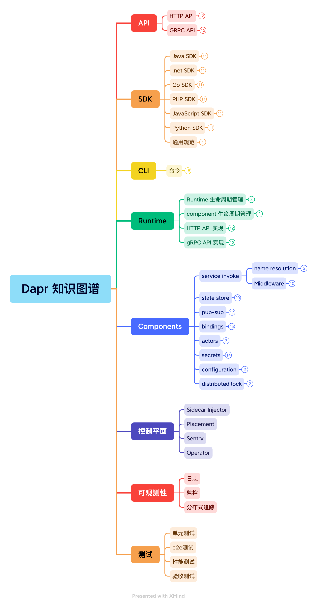
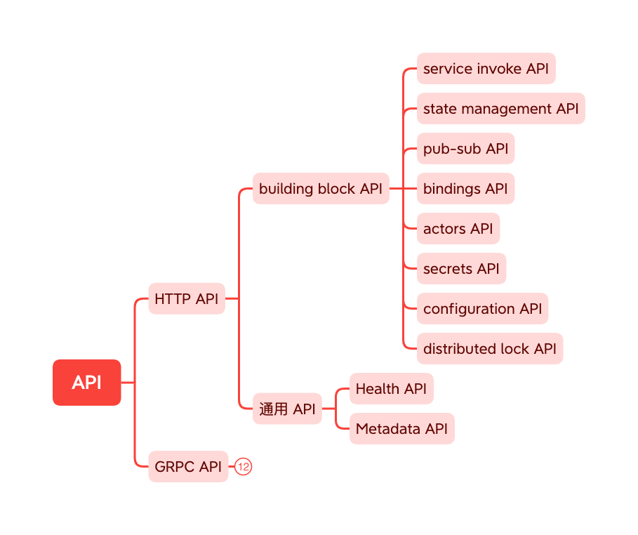
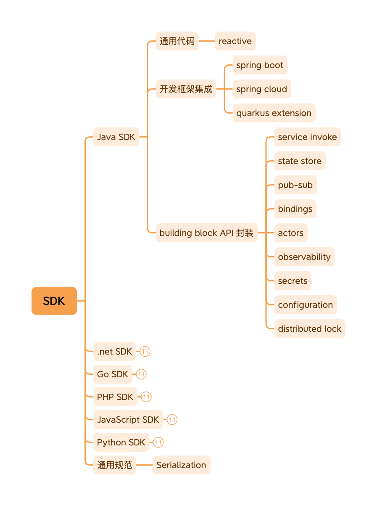
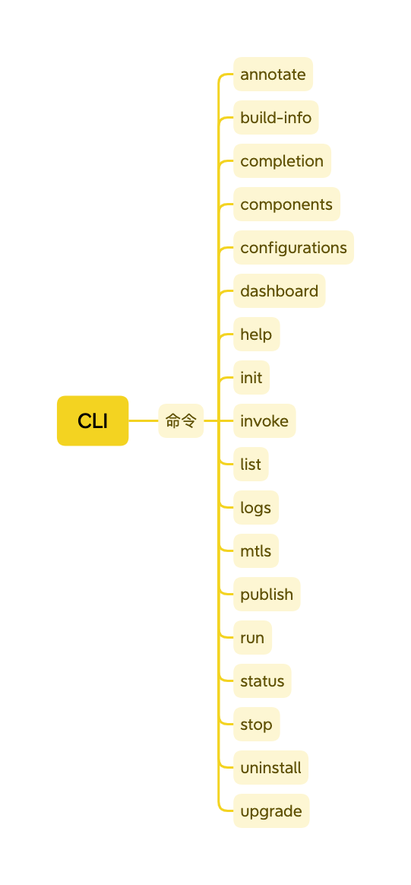
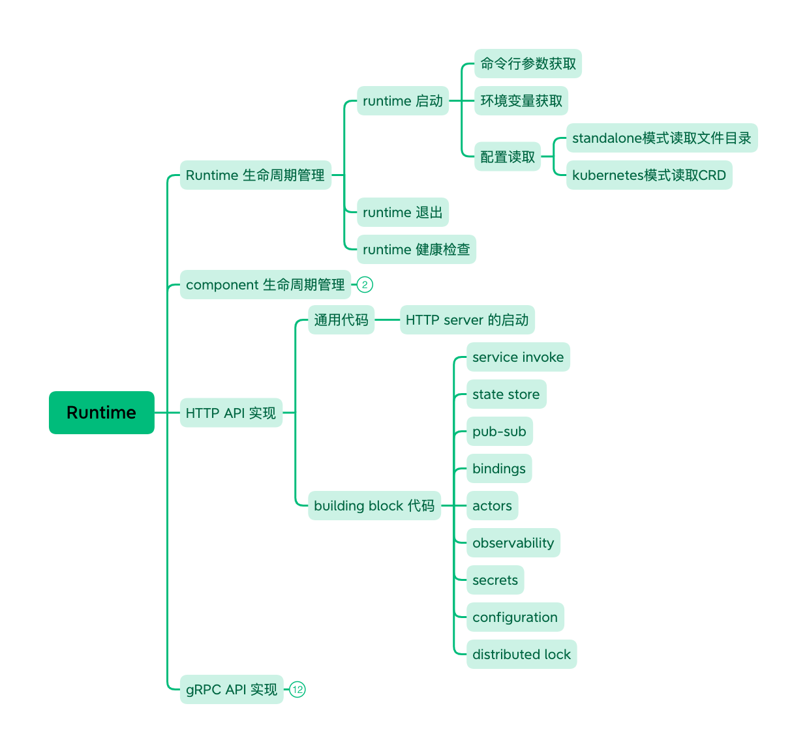
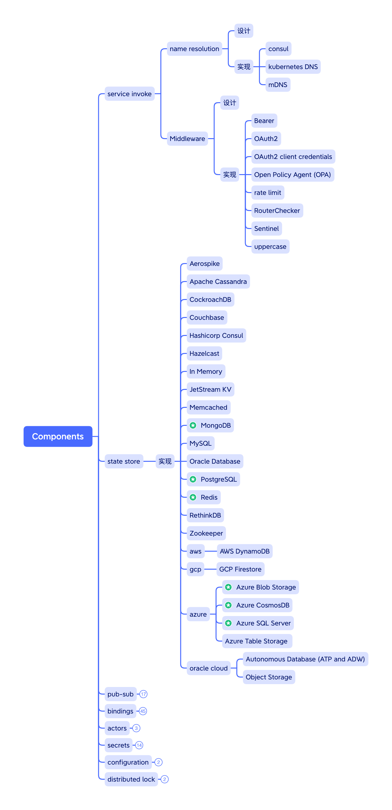

### 图谱说明

在概括性的梳理了 Dapr 的主要知识点之后，我们初步得到了一张 Dapr 的知识图谱。

后续随着内容的进一步展开，Dapr 的知识图谱会得到更多的补充和完善，我们将在整个源码解析过程中保持对 Dapr 知识图谱的持续更新。

### 图谱概览

下图为 Dapr 知识图谱的概览：

Dapr API 按照协议不同分为 HTTP API 和 gRPC API，内容主要是各个构建块的 API，但也包括部分通用 API 如 Health API 和 Metadata API，如下图所示：

在 Dapr API 之上，为了让开发者使用方便，Dapr 提供了各个语言的 SDK。以 Java SDK 为例，除了包括对各个构建块 API 的封装之外，还提供通用代码如 reactive 的实现，以及和主流开发框架的集成，如 spring boot，spring cloud，quarkus等。如下图所示：

为了方便使用，Dapr 提供了 CLI 命令行工具，提供的命令如下图所示：

Runtime （也就是大家熟知的 daprd）是 Dapr 的关键所在，主要对外提供各个构建块的 HTTP API 和 gRPC API，对内实现各个构建块的功能，而构建块实现的过程中会调用到各种组件。另外也包括 Runtime （sidecar）生命周期管理和 component 生命周期管理的职责：

组件是 Dapr 动态提供各种功能的关键所在，Dapr 目前有超过 100 个组件，部分组件已经到到 stable 状态（下图中标记有绿色五星图案）：

### 下载浏览

请点击下载完整版本的 Dapr 知识图谱（mindmap格式）并展开查看细节内容：

[Dapr 知识图谱](./dapr-knowledge-graph.xmind)

> 备注：请使用 xmind 软件打开，xmind 可以在 [xmind 官方网站](https://www.xmind.cn/download/) 下载

### 更新记录

- 2020-07-20：第一版

